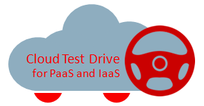

---
# ORACLE Cloud Test Drive Event - Application Development Labs #

## Introduction ##

This Oracle Cloud project contains the materials for the AppDev part of the Cloud Test Drive events, using a series of Oracle Cloud Services from the IaaS and PaaS family.  More specifically, these labs cover the following exercises :
+ Setting up a Weblogic infrastructure in the cloud via the GUI wizard of the Java Cloud Services.
+ Deploying a Bitnami opensource image onto the Oracle Compute Cloud
+ Deploying a Node.js script onto the Application Container Cloud via the GUI
+ Setting up a Springboot project using the Developer Cloud Services and deploying this to Application Container Cloud.

### Prerequisites ###

The workshop is intended to work with an Oracle PaaS trial account. To get an account look into [here](common/request.for.trial.md). Get the following account details ready to complete the tutorial and replace to your values when it is required:

+ Oracle Cloud account **username** and **password**
+ Oracle Cloud **identity domain**
+ **Data center/region**

NOTE: Before you start to use your new Oracle Public Cloud services make sure that the replication policy has been set for your account. Otherwise you can not create storage container which is necessary for most of the services. See [Selecting a Replication Policy for Oracle Storage Cloud Service](https://docs.oracle.com/cloud/latest/storagecs_common/CSSTO/GUID-5D53C11F-3D9E-43E4-8D1D-DDBB95DEC715.htm). 

### Important ###

During the execution you will create several public cloud service instances what will be available on the world wide web. Even if these instances are for demo purposes keep in mind it is not a best practice to use weak or known (stored here in the tutorial) passwords especially in such open environment. Thus this workshop content does not recommend any password so you need to define those. You will be asked to provide password at certain points and please remember them  for  later usage.

The content contains several independent modules that cover different aspects of the application development in the Oracle Cloud. These modules could be executed independently unless you find in the Prerequisites that they are dependent on each other.

----

####Support SpringBoot application development lifecycle using Oracle Developer Cloud Service, Application Container Cloud Service and Oracle Enterprise Pack For Eclipse####

+ [Create Oracle Developer Cloud Service project for SpringBoot application](springboot-sample/create.devcs.project.md)
+ [Create continuous build integration using Oracle Developer Cloud Service and Oracle Application Container Cloud Service](springboot-sample/devcs.accs.ci.md)
+ [Using Eclipse IDE (Oracle Enterprise Pack for Eclipse) with Oracle Developer Cloud Service](oepe/setup.oepe.md)

####Integrate telemetry into continuous delivery and monitor an application using the Oracle Management Cloud####
+ [Deploying APM Agent on Apache Tomcat based application and setting up Application Performance Monitoring](apm/README.md)

####Run Lightweight Java container (Tomcat) in the  Oracle Application Container Cloud Service####

+ [Deploy Apache Tomcat based application to Oracle Application Container Cloud](accs-tomcat/README.md)
+ [Scale up/down Application Container Service using user interface and PaaS Service Manager (PSM) Command Line Interface (CLI) tool](accs-psm/README.md)

####Clean up the environment####

+ [Delete Java Cloud, Database Cloud and Database Container Services using user interface](cleanup/cleanup-ui.md)
+ [Delete Application Cloud Container Service using PaaS Service Manager (PSM) Command Line Interface (CLI)](cleanup/cleanup-psm.md)

---

####Customizing and personalizing the workshop content####

+ [Customize and personalize the workshop materials](customize/README.md)

---

## [Contributing](CONTRIBUTING.md)
Pull Requests are currently not being accepted. See [CONTRIBUTING](CONTRIBUTING.md) for details.

## [License](LICENSE.md)
Copyright (c) 2014, 2016 Oracle and/or its affiliates
The Universal Permissive License (UPL), Version 1.0
