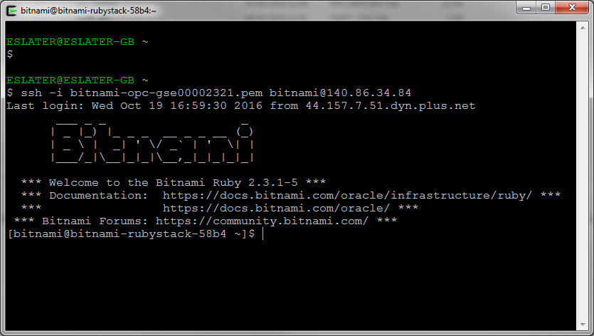
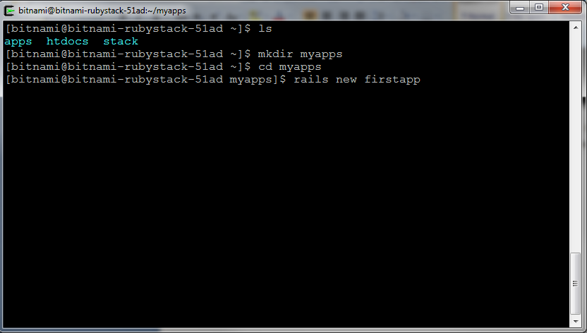
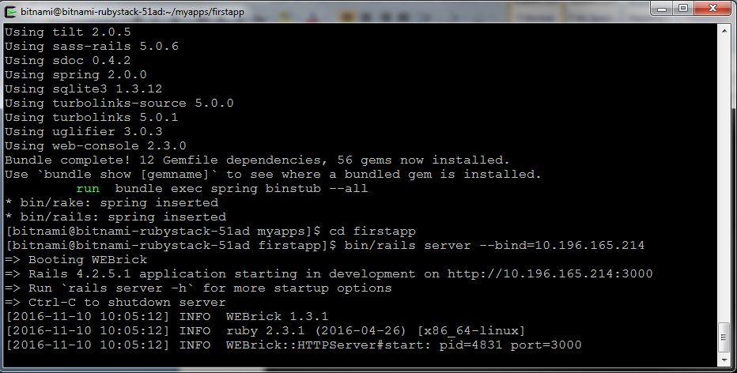

---
### ORACLE Cloud Test Drive Event ###
## Connecting to your Ruby instance on the Oracle Compute Cloud ##

First download the SSH keys of your new instance from the Bitnami Console window (ppk and pem files)

Now make sure you have a ssh tool on your PC.  If you don't have this, you can download [putty](bin/putty.exe) for this.

Use the public IP address of your instance you got from the Bitnami console

Go to the "SSH" and "Auth" menu, and select the private .ppk file you downloaded earlier

when prompted for "login", enter : bitnami

You should now have a command-line on your new instance !

If you run ifconfig, you will see the private ip of the instance and localhost.  Note that the private ip address is the same as the private ip address of the instance when viewed in the Oracle Cloud Compute console.
+ Take a note of this private IP address

Now execute following commands :
+ Create a directory myapp :  mkdir myapp
+ Move into this directory : cd myapp
+ Now create the new app called "firstapp" in Ruby : rails new firstapp

This will create a directory "firstapp", containing a skeleton rails application.

Start the application, substituting the private ip address of your VM for the binding:

+ Move into the firstapp directory : cd firstapp
+ Start the new application using the private IP address for your VM binding : bin/rails server --bind=10.196.165.214

  
WEBrick should start.
Leave the window open and the server running.
In the OPC console:
Find your instance (private IP is probably easiest way)
Click on the instance and take a note of its security list.
Create a new security application (“e.g. rails- <your-user-id>”) for TCP on port 3000
Create a new security rule (“e.g. rails-<your-user-id>”):
•	Application = rails-<your-user-id>
•	Source: public-internet
•	Destination: security list for your bitnami image (from above)
This should have opened your Bitnami VM to traffic from the internet on port 3000.
Check by browsing to the public ip of your image and port 3000.  You should see the “Riding the Rails” page:
 

