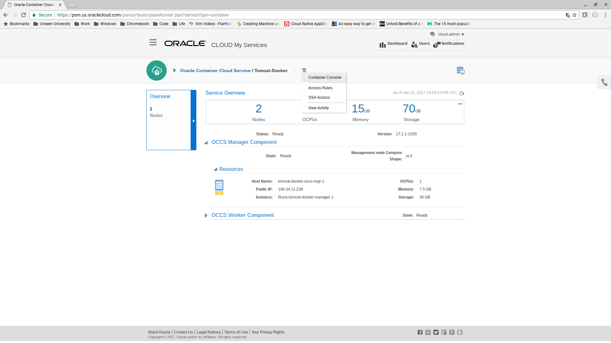
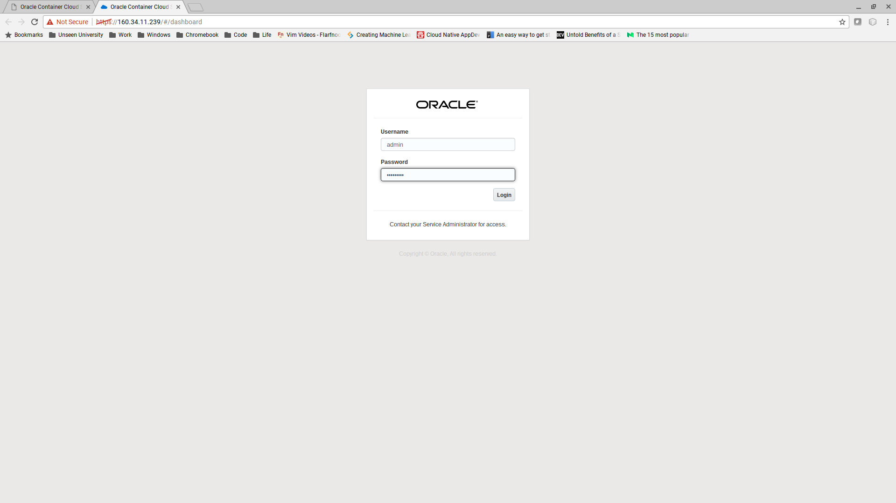
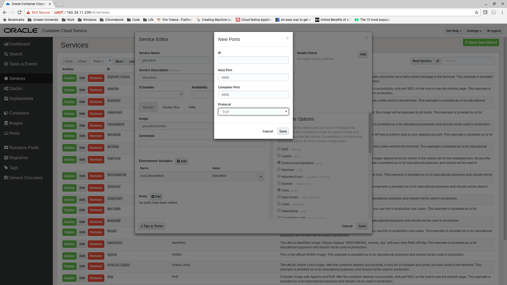
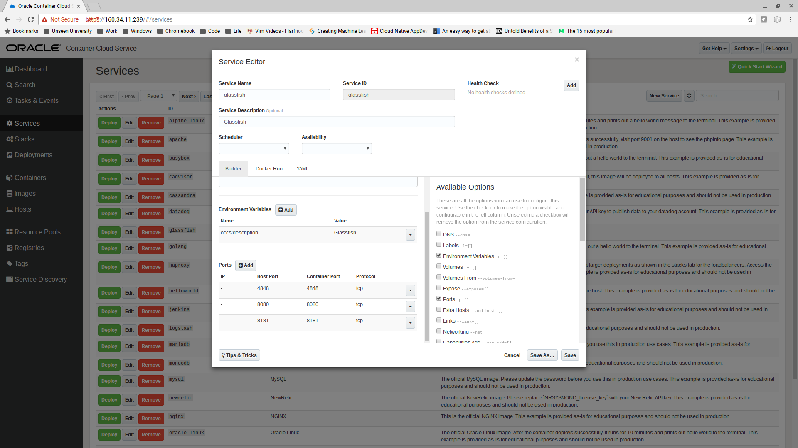
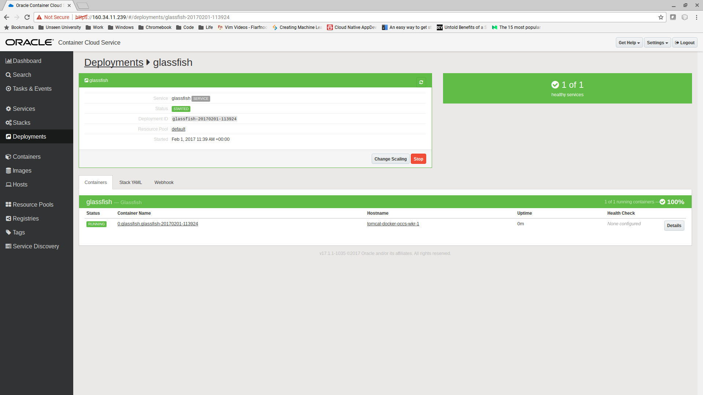
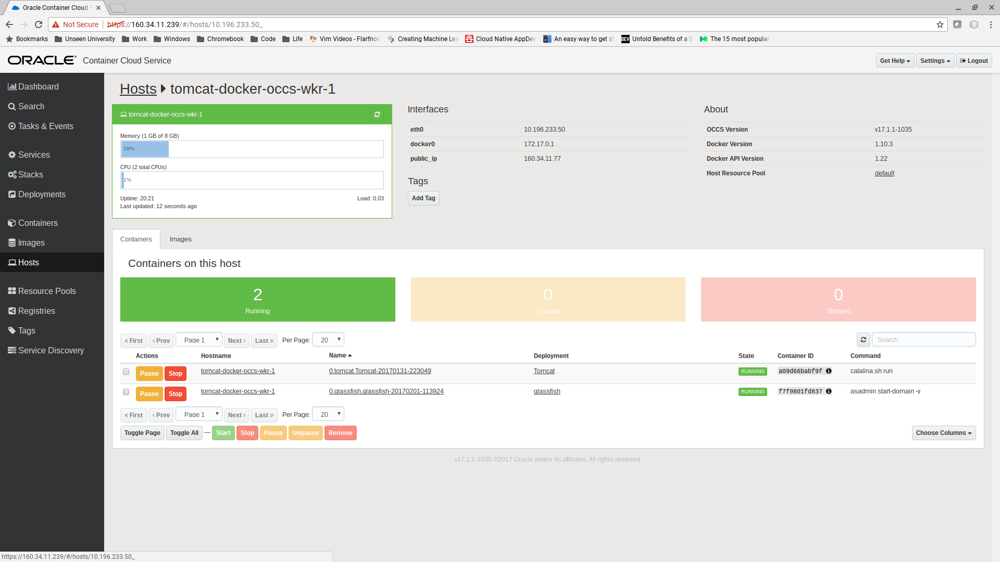
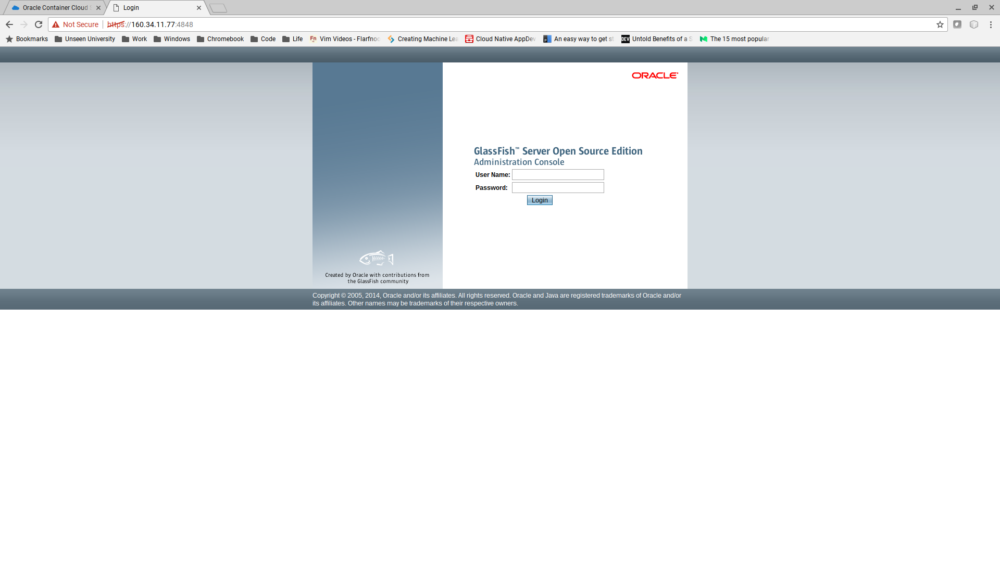
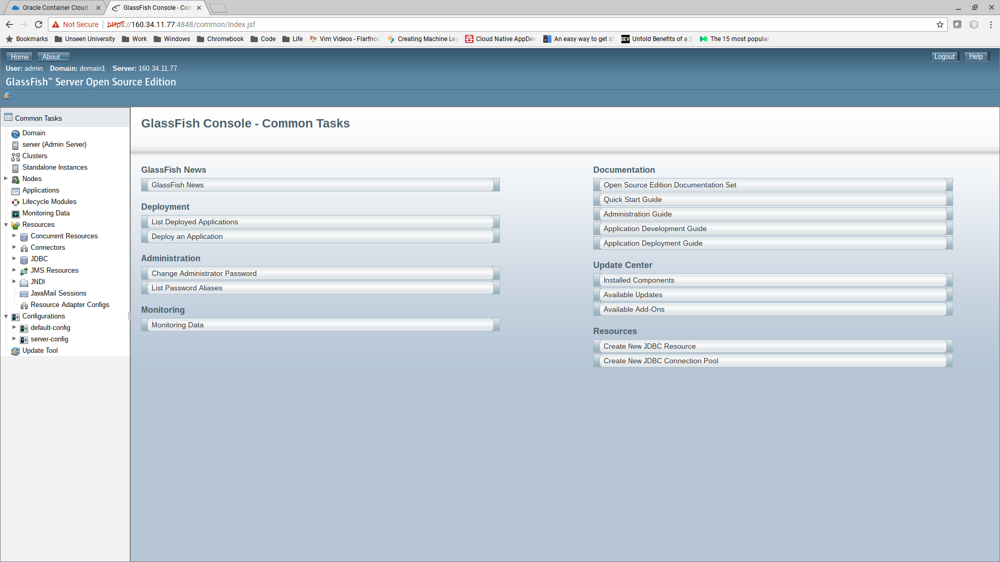
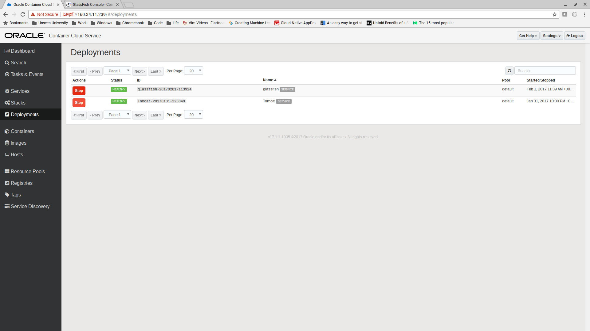
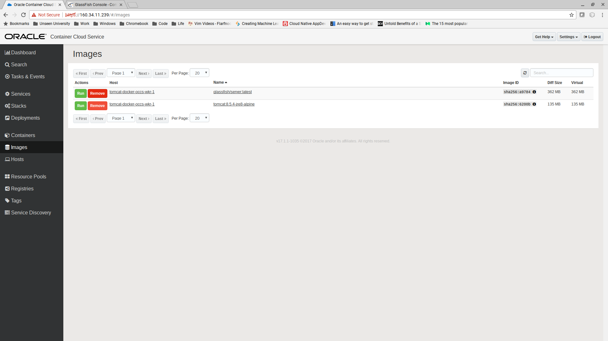

---
# ORACLE Cloud Test Drive Event
----
## Import and deploy a Glassfish Docker (not included by default) image onto Oracle Container Cloud Service

### Introduction
In this lab we will import and deploy a Glassfish Docker image onto the Oracle Container Cloud Service (OCCS).  The Glassfish image is not included by default.

Since creation of Docker containers is fast, and they are lightweight, everyone in the team should be able to take part.

### Pre - requisite Creation of a Container Cloud Service
The instructors will have created a Container Cloud service for your team to use.

This service will consist of an admin node and a number of worker nodes.  The containers are deployed on the worker nodes.

### Review your service instance
Navigate to the OCCS console.

Click on the link for your team's service.

Notice that there is a "Manager Component" and a "Worker Component".

### Open the OCCS console
Click on the "hamburger" and choose "Container Console".

At this point your browser may complain about a self signed certificate.  Accept the certificate and proceed to the console.

Enter the credentials supplied by the instructors.

You should now see the Dashboard.

### Create a new service for Glassfish

Click on Services.  Each of the "services" in the list represents a container and configuration ready for deployment onto OCCS.

Click "New Service" to go to create a new service for Glassfish.

The service editor dialog box will open.  Fill in the basic details as shown:

To be able to access the container from the outside world we need to add port mappings.

Each mapping routes traffic from <host>:<port> to <container>:<port>. 

To add the required mappings, click on the "Ports" checkbox under "Available Options" then click "+Add" and add each of the following port mappings:

- 8080:8080 (http)
- 8181:8181 (https)
- 4848:4848 (admin console)

For example the 4848 mapping should look like this:

The completed form should look like this:

Click on "Save".

The Glassfish service should now be shown in the "Services" list.

Click on "Deploy".

Take the defaults in the deploy glassfish dialog and click "Deploy".

The glassfish/server image should be downloaded and deployed to OCCS.

Click on the hostname link.  This is the host on which your image is deployed.

Take a note of the IP address and then browse to http://<host-ip-address>:4848 (add security exceptions if required)

You should see the Glassfish Administration Console Login form.

Login as admin/glassfish.  You should now see the login console.

If other members of your team want to try, go to "Deployments" and click "Stop".

Wait for Glassfish to stop and then click "Remove".

Once the deployment has disappeared, go to "Images" and click "Remove" for the Glassfish image.

Then go to "Services" and click "Remove" for the Glassfish service.

You can now repeat the lab.
