---
# ORACLE Cloud Test Drive Event
----
## Deploy the Tomcat Docker image (included by default) onto Oracle Container Cloud Service

### Introduction
In this lab we will deploy the Tomcat Docker image that is provided by default onto the Oracle Container Cloud Service (OCCS).

Since creation of Docker containers is fast, and they are lightweight, everyone in the team should be able to take part.

### Pre - requisite Creation of a Container Cloud Service
The instructors will have created a Container Cloud service for your team to use.

This service will consist of an admin node and a number of worker nodes.  The containers are deployed on the worker nodes.

### Review your service instance
Navigate to the OCCS console.

Click on the link for your team's service.

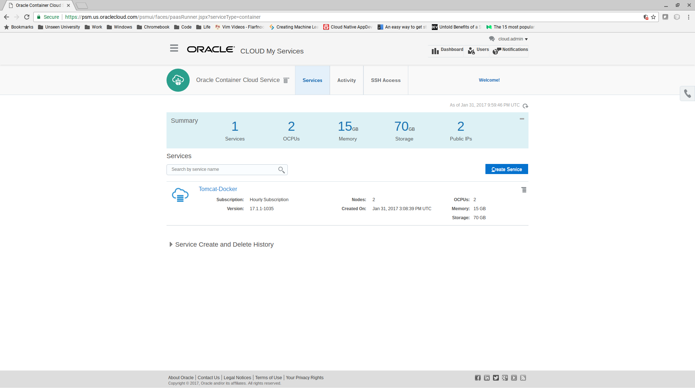

Notice that there is a "Manager Component" and a "Worker Component".

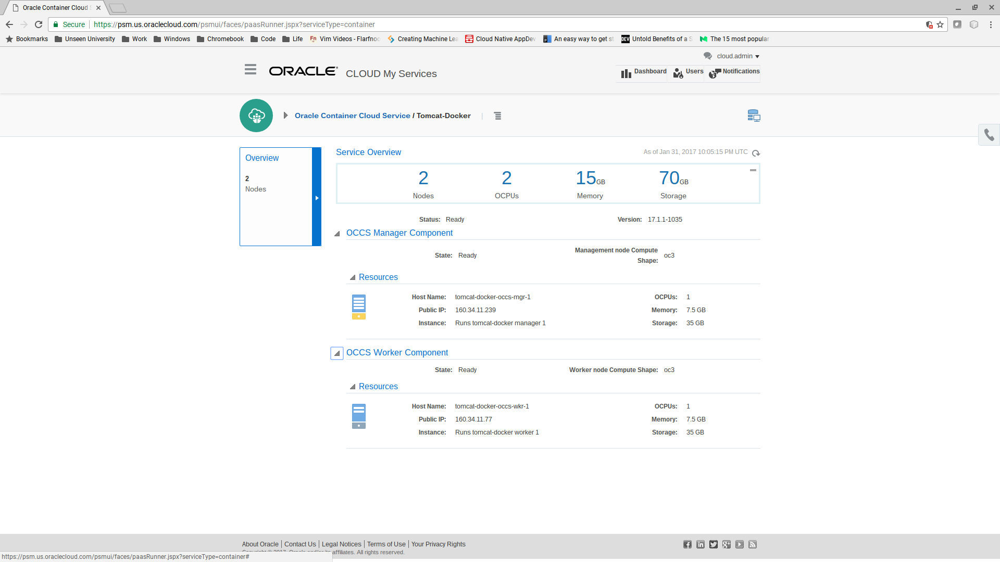

### Open the OCCS console
Click on the "hamburger" and choose "Container Console".

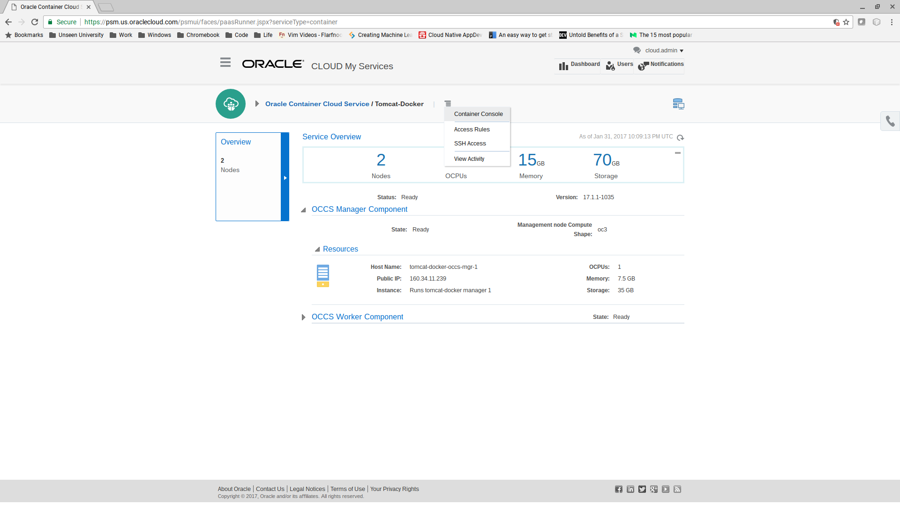

At this point your browser may complain about a self signed certificate.  Accept the certificate and proceed to the console.

Enter the credentials supplied by the instructors.

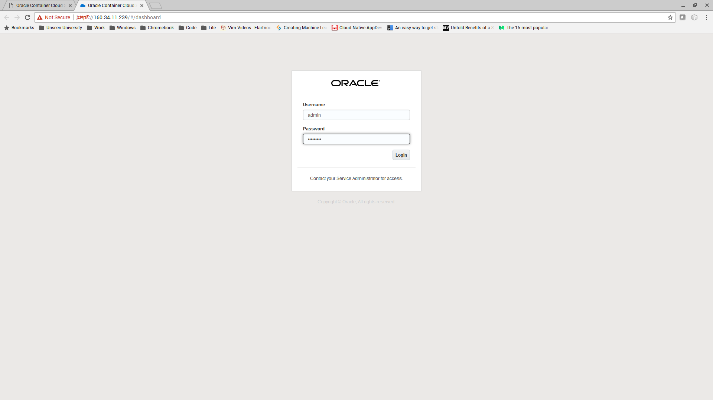

You should now see the Dashboard.

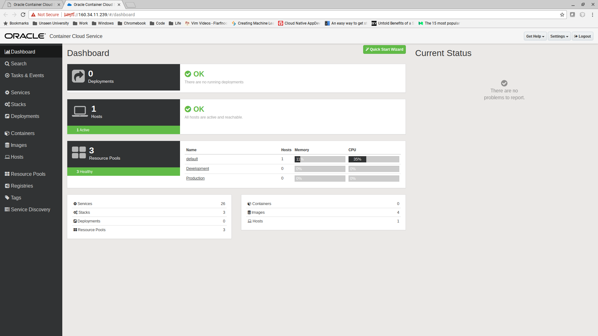

### Deploy the Tomcat Docker Image

Click on Services.  The list of "services" each represents container and configuration ready for deployment onto OCCS.

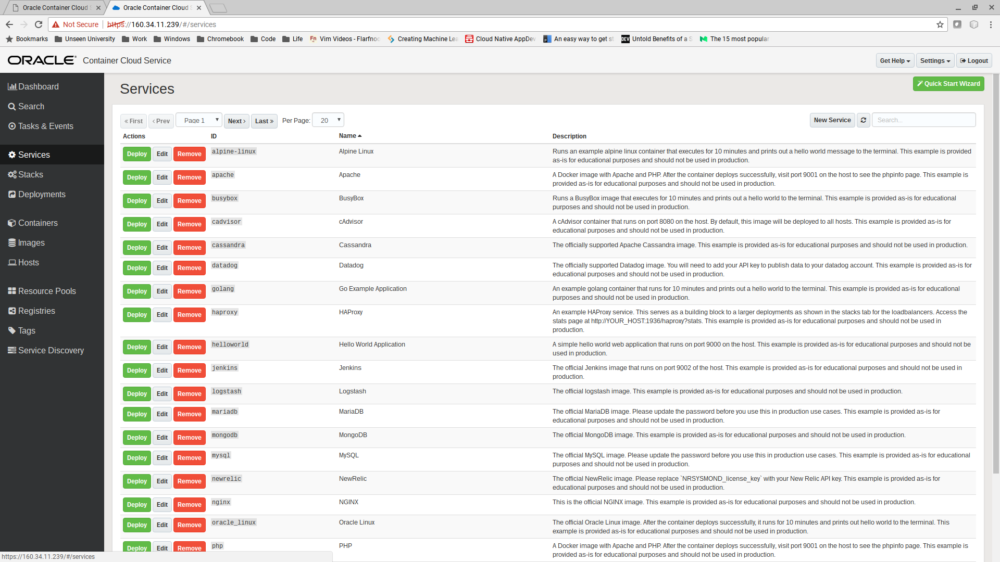

Click "Next" to go to the second page.  Click the "Deploy" button for the service with the id "tomcat".

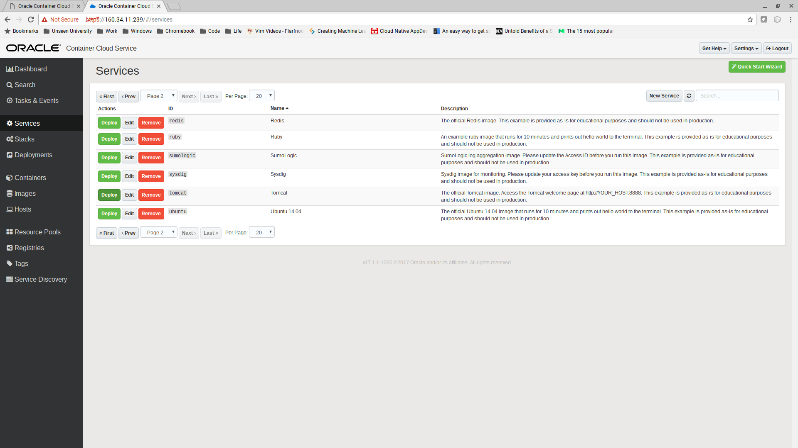

Take the default options in the dialog box, and click "Deploy".

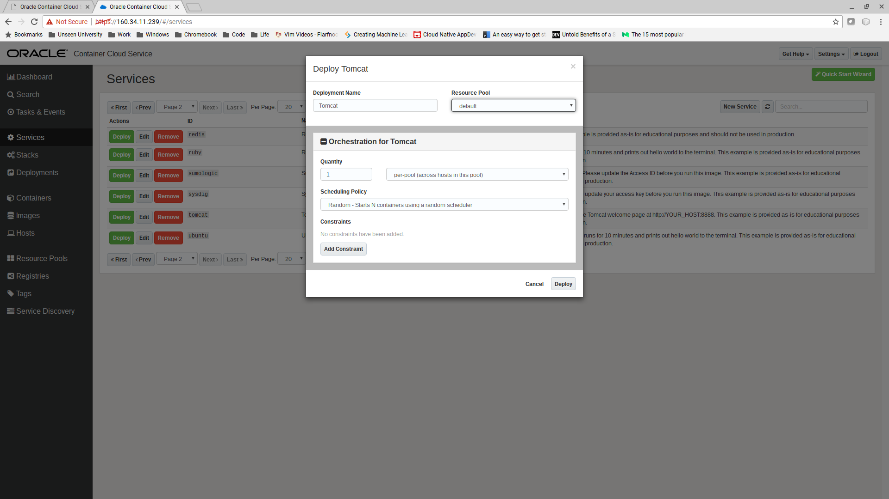

In a few seconds the container should start.

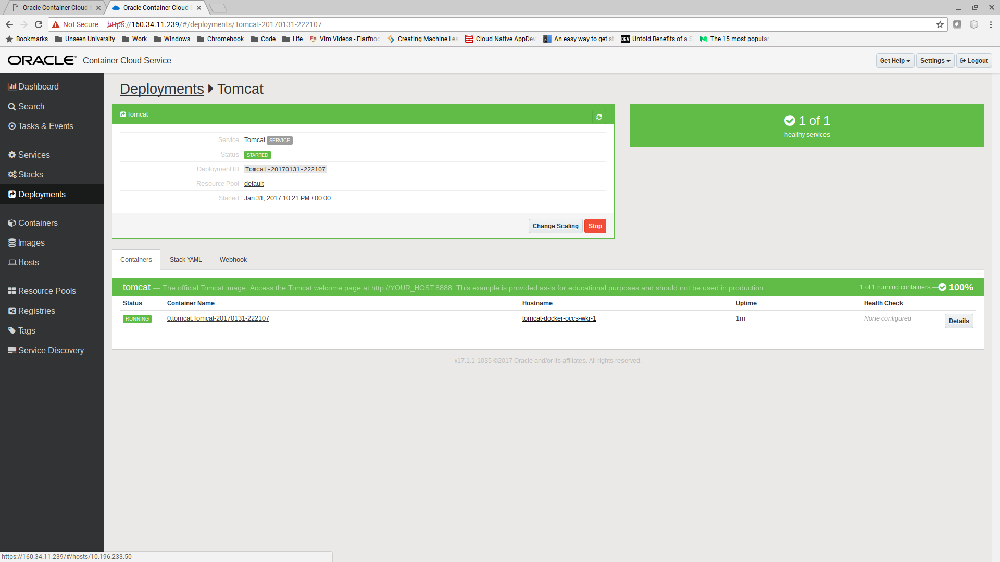

Click on the hostname link.  This is the host on which your image is deployed.

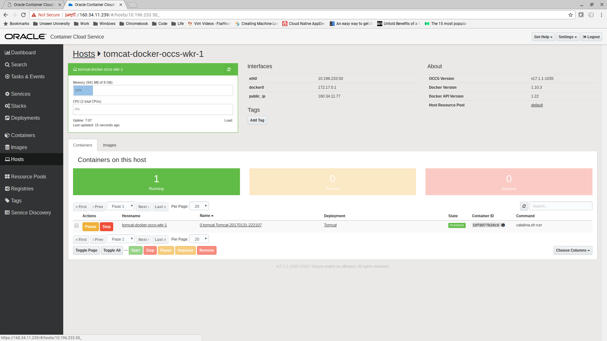

Take a note of the IP address and then browse to http://<host-ip-address>:8888

You should see the Apache Tomcat title page.

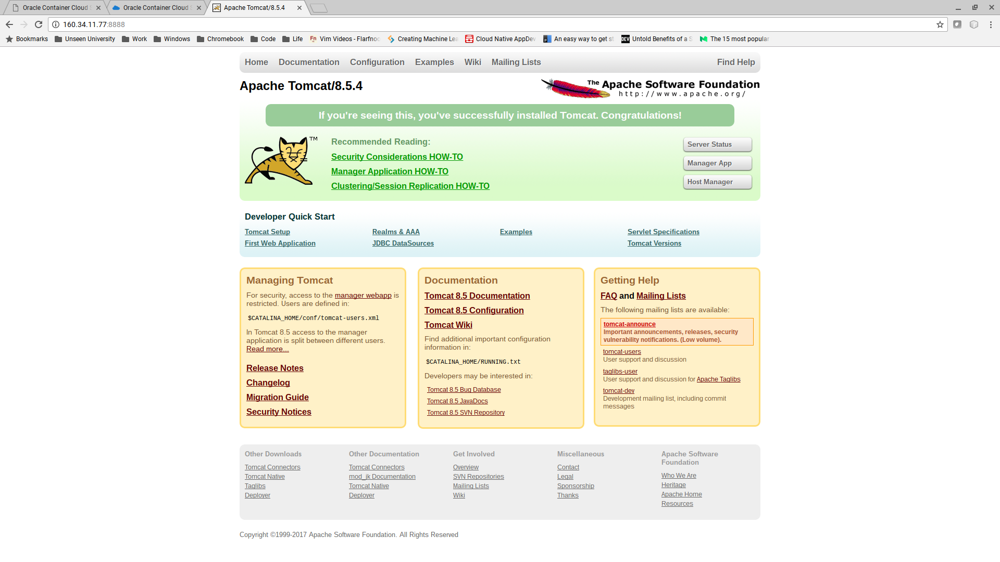

If other members of your team want to try, go to "Deployments" and click Stop.  Wait for Tomcat to stop and then click "Remove".

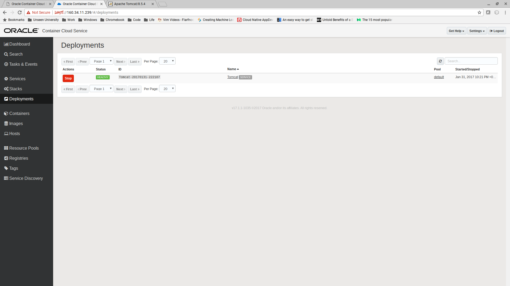

Once the deployment has disappeared, you can redeploy Tomcat.