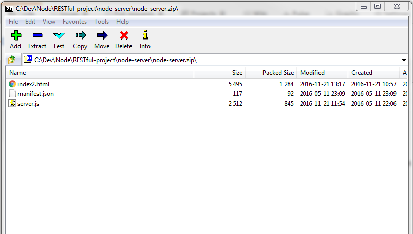
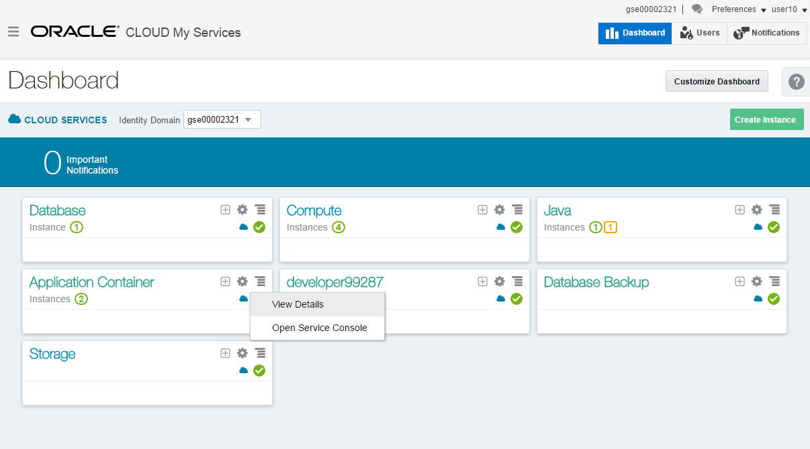
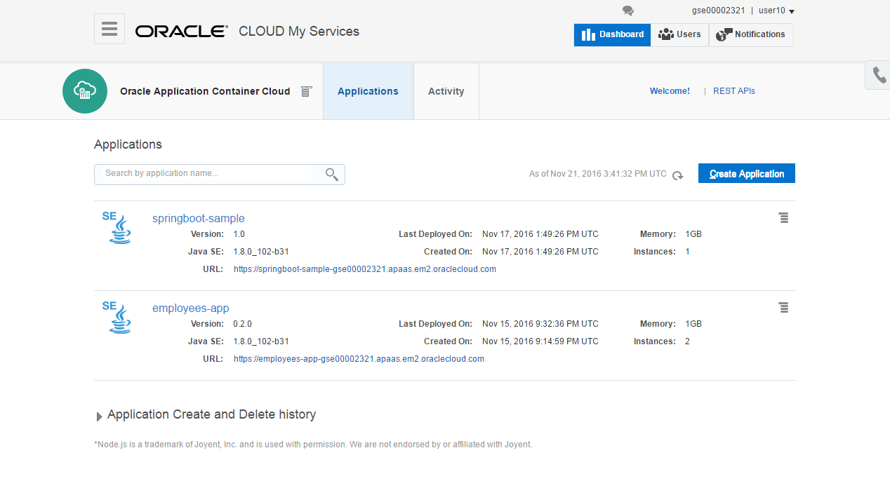
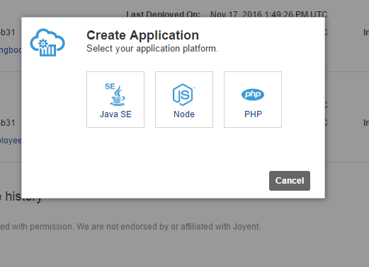
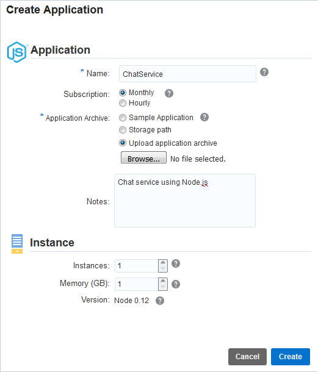
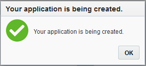
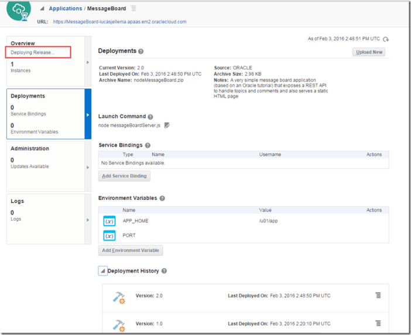
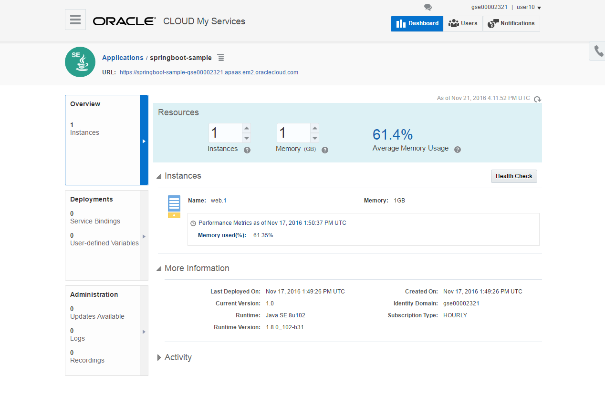
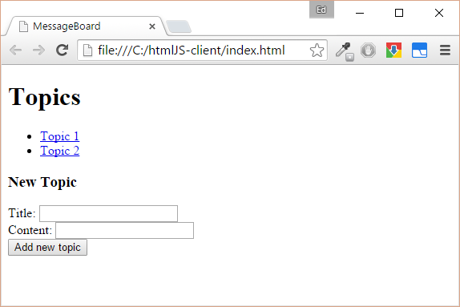
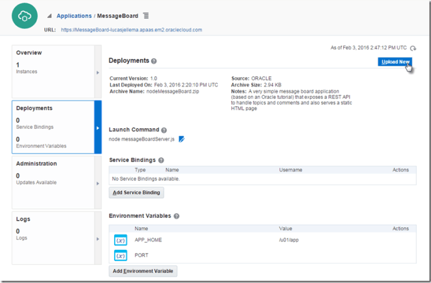

---
# ORACLE Cloud Test Drive Event#
----
## Deploy a simple Node.js application onto the Application Container Cloud using the GUI##

Start by downloading the [zip file](bin/node-server.zip) containing the Node.js artifacts of the application.  This is a very elementary Message Board application, allowing you to create topics and post entries on these topics.

Open the file to understand the content of this package : 
+ manifest.json : This file is specific to Application Container Cloud, and specifies how to start your application and the Node.js runtime version to use. Optionally, you can include notes and a release indication. 
+ server.js : the Node.js script running on the server
+ index2.htlm : a html5 script containing client-side javascript calling the server-side application

If you are interested in understanding this application, a [detailed tutorial to construct this application step by step](http://www.oracle.com/webfolder/technetwork/tutorials/obe/cloud/apaas/node-basicRest/nodecloud-REST.html#section2) is available.

Now launch your Oracle Cloud Dashboard:
+ Go to cloud.oracle.com and use your cloud credentials
+ Click on the "Hamburger" symbol besides the Application Container and select "Open Service Console"

On the Application Container Cloud overview page, you can see applications that are already created, and start the creation of new instances.  
+ Hit the "Create Application" button

+ Now select the "Node" Application

This brings you to the Create Application screen, where you can :
+ Enter a name for your application (for example mynode_<userxx>)
+ Select an Hourly subscription
+ Select to upload an archive.  Now you can select the "node-server.zip" file you downloaded earlier from your local filesystem
+ keep the defaults for nb. of instances and Memory to save resources for the other participants
+ Hit the "Create button

 
Your application is being created !
+ Click "OK".

You now see the status "Deployment being ceated"

You might have to hit the "Refresh buttons a few times, once your application has been deployed, the URL on the top of the screen will become enabled.

Click on the link to see the application running:

Now go back to the Application screen, and click on  the "Deployments" tab on the left, which allows you to add service bindings and environment variables to the application, and to the "Administration" tab to analyze the logs and manage updates of the framework version.

