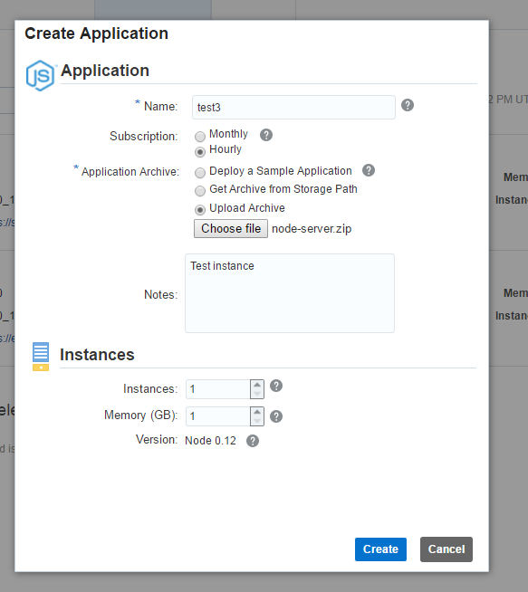

---
# ORACLE Cloud Test Drive Event#
----
## Deploy a simple Node.js application onto the Application Container Cloud using the GUI##

Start by downloading the [zip file](bin/node-server.zip) containing the Node.js artifacts of the application.  This is a very elementary Message Board application, allowing you to create topics and post entries on these topics.

Open the file to understand the content of this package : 
+ manifest.json : This file is specific to Application Container Cloud, and specifies how to start your application and the Node.js runtime version to use. Optionally, you can include notes and a release indication. 
+ server.js : the Node.js script running on the server
+ index2.htlm : a html5 script containing client-side javascript calling the server-side application

If you are interested in understanding this application, a [detailed tutorial to construct this application step by step](http://www.oracle.com/webfolder/technetwork/tutorials/obe/cloud/apaas/node-basicRest/nodecloud-REST.html#section2) is available.

Now launch your Oracle Cloud Dashboard:
+ Go to cloud.oracle.com and use your cloud credentials
+ Click on the "Hamburger" symbol besides the Application Container and select "Open Service Console"

On the Application Container Cloud overview page, you can see applications that are already created, and start the creation of new instances.

+ Hit the "Create Application" button

+ Now select the "Node" Application, which brings you to the Create Application screen.

 
After clicking the button Upload New, this popup appears:

+ Enter a name for your application and select Upload application archive

After specifying the new application archive, press OK.
The file is processed:
 

 
and redeployment takes place:
 

Log files are available for inspection. Anything written to the console from the Node.js application can be inspected from these files – that are written to the storage container associated with the JCS instance (I presume). At least I need to provide my Storage Cloud Service credentials in order to download the log file:
 
 
From the downloaded zip-file I can inspect the logs:
 
 

